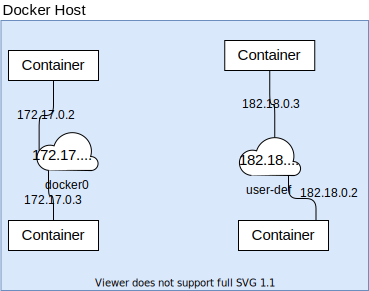

[![LinkedIn][linkedin-shield]][linkedin-url]


<!-- PROJECT LOGO -->
<br />
<p align="center">
  <a href="https://github.com/github_username/repo_name">
    
  </a>

  <h3 align="center">Global concepts of Docker</h3>


<!-- TABLE OF CONTENTS -->
<details open="open">
  <summary><h2 style="display: inline-block">Table of Contents</h2></summary>
  <ol>
    <li>
      <a href="#Intoduction">Intoduction</a>
      <!--
      <ul>
        <li><a href="#built-with">Built With</a></li>
      </ul>
      -->
    </li>
    <li>
      <a href="#getting-started">Getting Started</a>
      <ul>
        <li><a href="#prerequisites">Prerequisites</a></li>
        <li><a href="#installation">Installation</a></li>
      </ul>
    </li>
    <li><a href="#docker-architecture">Docker Architecture</a>
              <ul>
        <li><a href="#docker-daemon">Docker Daemon</a></li>
        <li><a href="#docker-client">Docker Client</a></li>
        <li><a href="#docker-registries">Docker registries</a></li>
        <li><a href="#docker-objects">Docker Objects</a></li>
      </ul></li>
    <li><a href="#images-vs-containers">Images VS Containers</a>
              <ul>
        <li><a href="#images">Images</a></li>
        <li><a href="#containers">Containers</a></li>
      </ul></li>
    <li><a href="#docker-commands">Docker Commands</a></li>
    <li><a href="#dockerfile-vs-docker-compose">Dockerfile VS Docker Compose</a>
          <ul>
        <li><a href="#dockerfile">Dockerfile</a></li>
        <li><a href="#docker-compose">Docker Compose</a></li>
      </ul>
    </li>
    <li><a href="#docker-storage-and-networking">Docker Storage and Networking</a>
              <ul>
        <li><a href="#docker-storage">Docker Storage</a></li>
        <li><a href="#ocker-networking">Docker Networking</a></li>
      </ul>
     </li>
      <li><a href="#projets">Projects</a>
              <ul>
        <li><a href="#spring-boot-demo">Spring-Boot Demo</a></li>
        <li><a href="#nodejs-demo">NodeJs Demo</a></li>
        <li><a href="#jupyter-notebook-demo">Jupyter-Notebook Demo</a></li>
      </ul>
     </li>
    <li><a href="#contact">Contact</a></li>
    <li><a href="#references">References</a></li>
  </ol>
</details>


<!-- ABOUT THE PROJECT -->
## Introduction

**Docker** is an open platform for developers and sysadmins to build, ship, and run distributed applications, whether on laptops, data center VMs, or the cloud.
Personally, I think that Docker became nowadays a main skill like Linux ans programming that everyone working in Computer Science field should know.
So, I write this course in order to introduce Docker to beginners.

<!-- GETTING STARTED -->
## Getting Started

Before we start, I recommend readers to use linux in this course.

### Prerequisites

What you should know before starting:
1. Linux Basics
2. Understand the basics of web and database servers (Not mandatory).

### Installation
This is an installation guide of Docker into a Debian distribution (Ubuntu, Linux Mint, ...), if you have another distribution installed in you laptop check the [official documentation](https://docs.docker.com/engine/install/) 
1. Update the apt package index and install packages to allow apt to use a repository over HTTPS:
   ```sh
   $ sudo apt-get update
   $ sudo apt-get install \
        apt-transport-https \
        ca-certificates \
        curl \
        gnupg \
        lsb-release
   ```
2. Add Docker’s official GPG key:
   ```sh
    $ curl -fsSL https://download.docker.com/linux/debian/gpg | sudo gpg --dearmor -o /usr/share/keyrings/docker-archive-keyring.gpg
   ```
3. Add Docker’s official GPG key:
   ```sh
    $ echo \
        "deb [arch=amd64 signed-by=/usr/share/keyrings/docker-archive-keyring.gpg] https://download.docker.com/linux/debian \
        $(lsb_release -cs) stable" | sudo tee /etc/apt/sources.list.d/docker.list > /dev/null
   ```
4. Update the apt package index, and install the latest version of Docker Engine and containerd:
   ```sh
    $ sudo apt-get update
    $ sudo apt-get install docker-ce docker-ce-cli containerd.io
    ```
5. Enable Docker for non-root user:
   ```sh
    $ sudo groupadd docker
    $ sudo usermod -aG docker $USER
    ```
   Log out and log back in so that your group membership is re-evaluated
   ```sh
    $ newgrp docker 
    $ sudo systemctl restart docker
    $ sudo systemctl enable docker
    ```
6. Verify that Docker Engine is installed correctly.
   ```sh
    $ docker run hello-world
    ```
(This command downloads a test image and runs it in a container. When the container runs, it prints a message and exits.)
<!-- Docker Architecture -->
## Docker Architecture
Docker uses the client-server architecture, where each Docker client communicate the the Docker daemon using a REST API, over UNIX
sockets or a network interface. They can run on the same system or the client can connect the daemon remotely.

### Docker Daemon
The Docker daemon `dockerd` listens for Docker API requests and manages Docker objects such as images, containers, networks, and volumes. A daemon can also communicate with other daemons to manage Docker services.
### Docker Client
The Docker client `docker` is the primary way that many Docker users interact with Docker. When you use commands such as `docker run`, the client sends these commands to `dockerd`, which carries them out. The `docker` command uses the Docker API. The Docker client can communicate with more than one daemon.
### Docker registries
A Docker registry stores Docker images. Docker Hub is a public registry that anyone can use, and Docker is configured to look for images on Docker Hub by default. You can even run your own private registry.

When you use the `docker pull` or `docker run commands`, the required images are pulled from your configured registry. When you use the `docker push` command, your image is pushed to your configured registry.
### Docker objects
When you use Docker, you are creating and using images, containers, networks, volumes, plugins, and other objects. This section is a brief overview of some of those objects.
<!-- Images VS Containers -->
## Images VS Containers

Images and Containers are main concepts of in Docker, it's mandatory to difference between them:
### Images
Docker image is like VM image, it's package or a template with instructions for creating a Docker container.
Often, an image is based on another image, with some additional customization. For example, you may build an image which is based on the `ubuntu` image, but installs the Apache web server and your application, as well as the configuration details needed to make your application run
You might create your own images or you might only use those created by others and published in a registry. To build your own image, you create a Dockerfile with a simple syntax for defining the steps needed to create the image and run it. Each instruction in a Dockerfile creates a layer in the image. When you change the Dockerfile and rebuild the image, only those layers which have changed are rebuilt. This is part of what makes images so lightweight, small, and fast, when compared to other virtualization technologies.
### Containers
Containers are completely isolated environment as they can have their own process or service, networking interfaces, mounts..., just like VM except they all share the same operating system kernel.

You can create, start, stop, move, or delete a container using the Docker API or CLI.
By default, a container is relatively well isolated from other containers and its host machine. You can control how isolated a container’s network, storage, or other underlying subsystems are from other containers or from the host machine.

A container is defined by its image as well as any configuration options you provide to it when you create or start it. When a container is removed, any changes to its state that are not stored in persistent storage disappear.


<!-- Docker Commands -->
## Docker Commands
In this section we will introduce all the basics commands:
* Pull command: this command is used to download an image from _dockerhub_.
    ``` 
    $ docker pull <ImageTag> 
    ```
  Example:
    ``` 
    $ docker pull ubuntu 
    ```
* Run command: is used to run a container from an image, running this command will run an instance of the image on the docker host. If the image doesn't exist locally, the docker run command will pull it from the _dockerhub_.
    ```
    $ docker run <imageTag>
    ``` 
    Example:
    ``` 
    $ docker run ubuntu --name ubuntuTest
    ```
* Ps command: Show information about the running containers.
    ```
    $ docker ps 
    ```
    To show information about all containers running or not.
    ``` 
    $ docker ps -a
    ```
    To show information about docker images.
    ``` 
    $ docker images 
    ```  
* Stop Command:
    To stop a running container
    ``` 
    $ docker stop <Container name or ID> 
    ```
    Example:
    ``` 
    $ docker stop ubuntuTest 
    ```
 * Remove Command:
    To remove a container. Note, you should stop the container before removing it.
    ``` 
    $ docker rm <Container name or ID> 
    ``` 
     Example:
    ``` 
    $ docker rm ubuntuTest 
    ```
   To remove an image, you must remove all it dependent containers.
   * Stop Command:
    To stop a running container
    ``` 
    $ docker rmi <Image name or ID> 
    ``` 
     Example:
    ``` 
    $ docker rmi ubuntu 
    ```
 * Execute Command: it execute a linux command inside a docker container.
    ``` 
    $ docker exec <Container name or ID> <linux command> 
    ```
     Example:
    ``` 
    $ docker exec ubuntuTest cat /etc/*release* 
    ```
 * Build Command: this command allow users to build their own images
     ``` 
    $ docker build [PATH to Dockerfile] . 
    ```
<!-- Dockerfile VS Docker Compose -->
## Dockerfile VS Docker Compose
### Dockerfile
Docker can build images automatically by reading the instructions from a _Dockerfile_. A _Dockerfile_ is a text document that contains all the commands a user could call on the command line to assemble an image. Using `docker build` users can create an automated build that executes several command-line instructions in succession.
Here's an example of building specific _Flask_ image based on Python image:
```dockerfile
FROM python:3.8
WORKDIR /project
ADD . /project
RUN pip install --default-timeout=100 -r requirements.txt
EXPOSE 5000
CMD ["flask", "run", "-h", "0.0.0.0", "-p", "5000"]
```


Let's explain each line in details:

`FROM`: creates a layer from the `python:3.8` Docker image.

`WORKDIR`: This instruction sets the working directory for any `RUN`, `CMD`, `ENTRYPOINT`, `COPY` and `ADD` instructions that follow it in the _Dockerfile_

`ADD`: copies new files, directories or remote file URLs from `<src>` and adds them to the filesystem of the image at the path `<dest>`.

`RUN`: lets you execute commands inside of your Docker image. These commands get executed once at build time and get written into your Docker image as a new layer. In our example, it install requirement packages inside the images.

`EXPOSE`:  instruction informs Docker that the container listens on the specified network ports at runtime. You can specify whether the port listens on TCP or UDP, and the default is TCP if the protocol is not specified.

`CMD`: sets default command and/or parameters, which can be overwritten from command line when docker container runs.

To build this image you need just run the following command:

    $ docker build -t myImage .

To run it:

    $ docker run -d -p 5000:5000 --name myContainer myImage -d

    
### Docker Compose
Compose is a tool for defining and running multi-container Docker applications. With Compose, you use a YAML file to configure your application’s services. Then, with a single command, you create and start all the services from your configuration. 

Using Compose is basically a three-step process:

1. Define your app’s environment with a _Dockerfile_ so it can be reproduced anywhere.

2. Define the services that make up your app in `docker-compose.yml` so they can be run together in an isolated environment.

3. Run `docker-compose up` and the Docker compose command starts and runs your entire app. 

Example:

Let's go back to our Flask application and connect it to a MySQL Database, we create a new file `docker-compose.yml` (here we will use the version 2 of docker-compose file, for more about versions check [this](https://docs.docker.com/compose/compose-file/compose-versioning/)):
```yaml
version: "2"
services:
  app:
    build: ./app
    links:
      - db
    ports:
      - "5000:5000"
  db:
    image: mysql:5.7
    ports:
      - "32000:3306"
    environment:
      MYSQL_ROOT_PASSWORD: root
    volumes:
      - ./db:/docker-entrypoint-initdb.d/:ro
```
We are using two services, one is a container which exposes the REST API (app), and one contains the database (db).

`build`: specifies the directory which contains the Dockerfile containing the instructions for building this service

`links`: links this service to another container. This will also allow us to use the name of the service instead of having to find the ip of the database container, and express a dependency which will determine the order of start up of the container

`ports`: mapping of `<Host>:<Container>` ports.

`image`: Like the `FROM` instruction from the _Dockerfile_. Instead of writing a new Dockerfile, we are using an existing image from a repository. It’s important to specify the version — if your installed `mysql` client is not of the same version problems may occur.

`environment`: add environment variables. The specified variable is required for this image, and as its name suggests, configures the password for the root user of MySQL in this container. More variables are specified here.

`ports`: Since I already have a running mysql instance on my host using this port, I am mapping it to a different one. Notice that the mapping is only from host to container, so our app service container will still use port 3306 to connect to the database.

`volumes`: since we want the container to be initialized with our schema, we wire the directory containing our init.sql script to the entry point for this container, which by the image’s specification runs all .sql scripts in the given directory.

<!-- Docker Storage and Docker Networking -->
## Docker Storage and Docker Networking

### Docker Storage
Docker stores data pertaining to images, containers, volumes, etc under `/var/lib/docker`.


You can create a docker volume by using the `docker volume create` command. This command will create a volume in the `/var/lib/docker/volumes` directory.

```shell script
$ docker volume create data_volume
```

Now when you run the `docker run` command, you can specify which volume to use using the -v flag. This is called Volume Mounting.

```shell script
$ docker run -v data_volume:/var/lib/mysql mysql
```

If the volume does not exist, docker creates one for you. Now, even if the container is destroyed the data will persist in the volume.

If you want to have your data on a specific location on the docker host or already have existing data on the disk, you can mount this location on the container as well. This is called Bind Mounting.

```shell script
$ docker run -v /data/mysql:/var/lib/mysql mysql
```

### Docker Networking

When you install docker it creates three networks automatically - Bridge, Host, and None. Of which, Bridge is the default network a container gets attached to when it is run. To attach the container to any other network you can use the `--network` flag of the run command.


The Bridge network assigns IPs in the range of `172.17.x.x` to the containers within it. To access these containers from outside you need to map the ports of these containers to the ports on the host. Another automatically created network is Host. Selecting the Host network will remove any network isolation between the docker host and the containers. For instance, if you run a container on port `5000`, it will be accessible on the same port on the docker host without any explicit port mapping. The only downside of this approach is that you can not use the same port twice for any container. Finally, the None network keeps the container in complete isolation, i.e. they are not connected to any network or container.

The containers can reach each other using their names. This is made possible by an Embedded DNS which runs on the address `127.0.0.11`.


The containers get attached to the same network by default. What can we do if we want two containers on a separate network?


We can define a user-defined network for this purpose by using the following command and assigning this network when running the containers.




<!-- Projects -->
## Projects
### Spring-boot Demo
This is a [demo](projects/Backend) for a simple Login system using _Spring-boot_ and _PostgreSQL_. Here's our _Dockerfile_:

```dockerfile
FROM maven:3.6-jdk-8-slim AS build
COPY src /home/app/src
COPY pom.xml /home/app
RUN mvn -f /home/app/pom.xml clean package -DskipTests

FROM openjdk:8-jdk-alpine
ARG JAR_FILE=/home/app/target/acmbackend-0.0.1-SNAPSHOT.jar
COPY --from=build ${JAR_FILE} application.jar
ENTRYPOINT ["java", "-jar", "application.jar"]
```
### NodeJS Demo

Samir Samir

### Jupyter-notebook Demo

Samir Samir


<!-- CONTACT -->
## Contact

Your Name - [@twitter_handle](https://twitter.com/twitter_handle) - email

Project Link: [https://github.com/github_username/repo_name](https://github.com/github_username/repo_name)


<!-- references -->
## References

* [Docker](https://docs.docker.com/)
* [Playing with Java Microservices on Kubernetes and OpenShift](https://www.amazon.fr/Playing-Java-Microservices-Kubernetes-OpenShift/dp/1796877247)


<!-- MARKDOWN LINKS & IMAGES -->
<!-- https://www.markdownguide.org/basic-syntax/#reference-style-links -->

[license-shield]: https://img.shields.io/github/license/github_username/repo.svg?style=for-the-badge
[license-url]: https://github.com/github_username/repo_name/blob/master/LICENSE.txt
[linkedin-shield]: https://img.shields.io/badge/-LinkedIn-black.svg?style=for-the-badge&logo=linkedin&colorB=555
[linkedin-url]: https://www.linkedin.com/in/hamzagbada/
